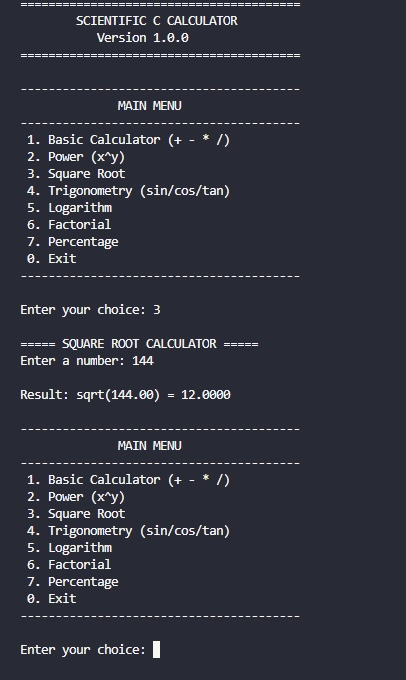

[](https://github.com/sakib-vi/scientific-calculator/actions/workflows/build.yml)

# Scientific Calculator

A command-line scientific calculator written in C, designed to perform common arithmetic and scientific mathematical operations.

## Features

- Basic arithmetic operations
- Scientific calculations
- Trigonometric functions
- Logarithmic functions
- Power and root calculations
- Interactive command-line interface
- Modular C project structure
- Cross-platform build support through Makefile


## Screenshots

### Main Interface


### Example Calculation



## Project Structure

```text
scientific-calculator/
├── include/
│   └── Header files
├── src/
│   └── Source files
├── screenshots/
│   └── Project screenshots
├── .github/
│   └── workflows/
├── .gitignore
├── CONTRIBUTING.md
├── LICENSE
├── Makefile
└── README.md
